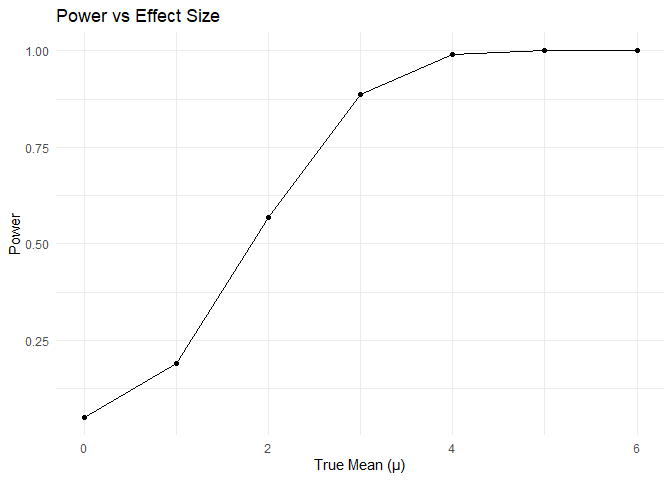
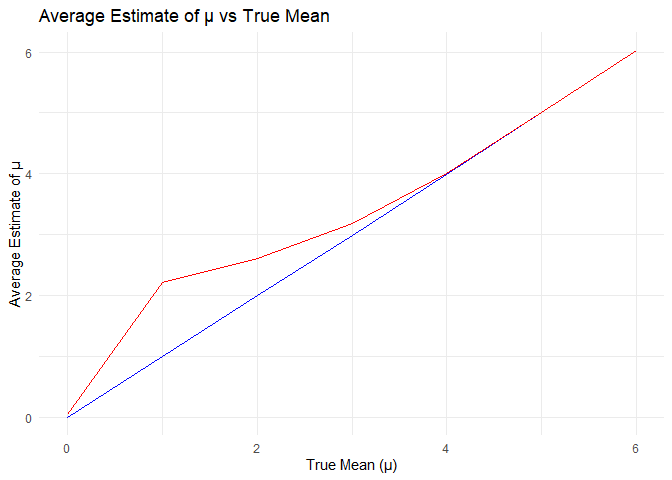
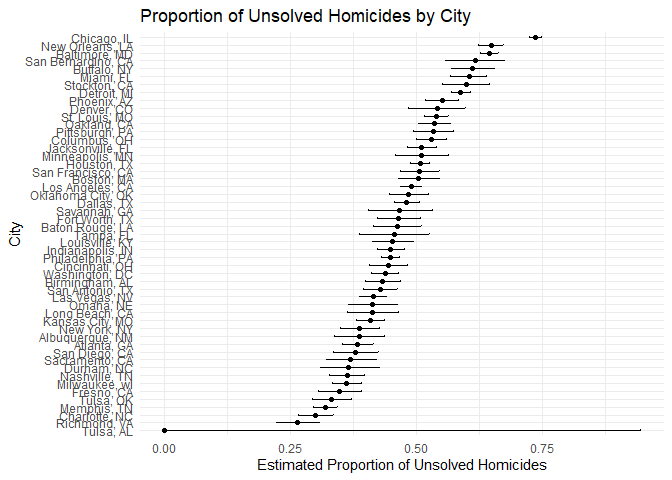

p8105_hw5_tt3022
================
Thomas Tang
2024-11-15

library

``` r
library(ggplot2)
library(broom)
library(tidyverse)
```

    ## ── Attaching core tidyverse packages ──────────────────────── tidyverse 2.0.0 ──
    ## ✔ dplyr     1.1.4     ✔ readr     2.1.5
    ## ✔ forcats   1.0.0     ✔ stringr   1.5.1
    ## ✔ lubridate 1.9.3     ✔ tibble    3.2.1
    ## ✔ purrr     1.0.2     ✔ tidyr     1.3.1
    ## ── Conflicts ────────────────────────────────────────── tidyverse_conflicts() ──
    ## ✖ dplyr::filter() masks stats::filter()
    ## ✖ dplyr::lag()    masks stats::lag()
    ## ℹ Use the conflicted package (<http://conflicted.r-lib.org/>) to force all conflicts to become errors

Problem 2

``` r
set.seed(1)

n <- 30            
sigma <- 5          
mu_values <- 0:6    
iterations <- 5000  
alpha <- 0.05      

perform_t_test <- function(mu) {
  data <- rnorm(n, mean = mu, sd = sigma)
  test_result <- t.test(data, mu = 0)
  tidy(test_result) %>% 
    select(estimate = estimate, p.value)
}


sim_results <- expand_grid(
  mu = mu_values,
  iter = 1:iterations
) %>%
  mutate(
    test_results = map(mu, perform_t_test)
  ) %>%
  unnest(test_results)


power_results <- sim_results %>%
  group_by(mu) %>%
  summarize(power = mean(p.value < alpha))
```

create power plot

``` r
ggplot(power_results, aes(x = mu, y = power)) +
  geom_line() +
  geom_point() +
  labs(
    title = "Power vs Effect Size",
    x = "True Mean (μ)",
    y = "Power"
  ) +
  theme_minimal()
```

<!-- -->

The association between effect size and power is positive and
non-linear. As the effect size grows, the power of the test increases
rapidly at first and then plateaus near 1.

``` r
average_estimates <- sim_results %>%
  group_by(mu) %>%
  summarize(
    mean_estimate = mean(estimate),
    mean_estimate_rejected = mean(estimate[p.value < alpha])
  )

ggplot(average_estimates, aes(x = mu)) +
  geom_line(aes(y = mean_estimate), color = "blue") +
  geom_line(aes(y = mean_estimate_rejected), color = "red") +
  labs(
    title = "Average Estimate of µ vs True Mean",
    x = "True Mean (μ)",
    y = "Average Estimate of μ",
    color = "Estimate Type"
  ) +
  scale_color_manual(
    values = c("blue" = "All Samples", "red" = "Rejected Samples")
  ) +
  theme_minimal()
```

<!-- -->

The sample average of mu for tests where the null is rejected is not
approximately equal to the true value of mu for smaller effect sizes. As
mu increases, this bias decreases, and the sample average of my in
rejected tests becomes more representative of the true mu.

Problem 3:

``` r
homicide_data <- read_csv("data/homicide-data.csv")
summary(homicide_data)
```

    ##      uid            reported_date       victim_last        victim_first      
    ##  Length:52179       Min.   : 20070101   Length:52179       Length:52179      
    ##  Class :character   1st Qu.: 20100318   Class :character   Class :character  
    ##  Mode  :character   Median : 20121216   Mode  :character   Mode  :character  
    ##                     Mean   : 20130899                                        
    ##                     3rd Qu.: 20150911                                        
    ##                     Max.   :201511105                                        
    ##                                                                              
    ##  victim_race         victim_age         victim_sex            city          
    ##  Length:52179       Length:52179       Length:52179       Length:52179      
    ##  Class :character   Class :character   Class :character   Class :character  
    ##  Mode  :character   Mode  :character   Mode  :character   Mode  :character  
    ##                                                                             
    ##                                                                             
    ##                                                                             
    ##                                                                             
    ##     state                lat             lon          disposition       
    ##  Length:52179       Min.   :25.73   Min.   :-122.51   Length:52179      
    ##  Class :character   1st Qu.:33.77   1st Qu.: -96.00   Class :character  
    ##  Mode  :character   Median :38.52   Median : -87.71   Mode  :character  
    ##                     Mean   :37.03   Mean   : -91.47                     
    ##                     3rd Qu.:40.03   3rd Qu.: -81.76                     
    ##                     Max.   :45.05   Max.   : -71.01                     
    ##                     NA's   :60      NA's   :60

``` r
homicide_data <- homicide_data %>%
  mutate(city_state = paste(city, state, sep = ", "))

# Define unsolved homicides
unsolved_dispositions <- c("Closed without arrest", "Open/No arrest")

# Summarize data within cities
city_summary <- homicide_data %>%
  group_by(city_state) %>%
  summarize(
    total_homicides = n(),
    unsolved_homicides = sum(disposition %in% unsolved_dispositions)
  ) %>%
  arrange(desc(total_homicides))
write_csv(city_summary, "city_homicide_summary.csv")
```

There is 52,179 rows and 12 columns including identifiers, victim
information, location, and disposition.

``` r
baltimore_data <- homicide_data %>%
  filter(city_state == "Baltimore, MD")

# Total homicides and unsolved homicides in Baltimore, MD
total_homicides <- nrow(baltimore_data)
unsolved_homicides <- sum(baltimore_data$disposition %in% unsolved_dispositions)

prop_test_result <- prop.test(
  x = unsolved_homicides,  # Number of unsolved homicides
  n = total_homicides      # Total homicides
)
prop_test_summary <- tidy(prop_test_result)
print(prop_test_summary)
```

    ## # A tibble: 1 × 8
    ##   estimate statistic  p.value parameter conf.low conf.high method    alternative
    ##      <dbl>     <dbl>    <dbl>     <int>    <dbl>     <dbl> <chr>     <chr>      
    ## 1    0.646      239. 6.46e-54         1    0.628     0.663 1-sample… two.sided

Estimated Proportion of Unsolved Homicides: 0.646 95% Confidence
Interval: \[0.628, 0.663\]

``` r
unsolved_dispositions <- c("Closed without arrest", "Open/No arrest")

city_prop_test_results <- homicide_data %>%
  mutate(city_state = paste(city, state, sep = ", ")) %>%
  group_by(city_state) %>%
  summarize(
    total_homicides = n(),
    unsolved_homicides = sum(disposition %in% unsolved_dispositions)
  ) %>%
  mutate(
    prop_test = map2(unsolved_homicides, total_homicides, ~ prop.test(.x, .y)),
    tidy_results = map(prop_test, broom::tidy)
  ) %>%
  unnest(tidy_results) %>%
  select(city_state, estimate, conf.low, conf.high)
```

To create a plot:

``` r
ggplot(city_prop_test_results, aes(x = reorder(city_state, estimate), y = estimate)) +
  geom_point() +
  geom_errorbar(aes(ymin = conf.low, ymax = conf.high), width = 0.2) +
  coord_flip() +
  labs(
    title = "Proportion of Unsolved Homicides by City",
    x = "City",
    y = "Estimated Proportion of Unsolved Homicides"
  ) +
  theme_minimal()
```

<!-- -->
